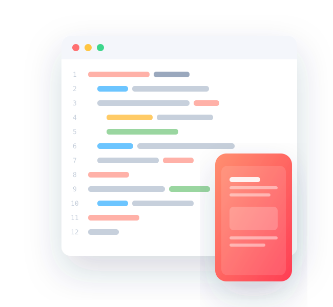

# Blogr Landing Page

A fully responsive landing page for **Blogr**, a fictional modern publishing platform.
This is a solution to the [Blogr landing page challenge on Frontend Mentor](https://www.frontendmentor.io/challenges/blogr-landing-page-EX2RLAHa5), built as a Web Design Cohort capstone project.



---

## 📋 Submission Details

| Field | Value |
|-------|-------|
| **Full Name** | [YOUR NAME] |
| **Matric Number** | [MATRIC NUMBER] |
| **Email Address** | oladipodayogeorge@gmail.com |
| **Live Project Link** | [ADD YOUR DEPLOYED URL] |
| **GitHub Repository** | [ADD YOUR REPO URL] |

---

## 🚀 Overview

Blogr is a clean, content-focused landing page featuring a gradient hero, curved
section dividers, an accessible dropdown navigation, and a fully functional mobile menu.

### Built with

- **Semantic HTML5** — landmark elements (`header`, `nav`, `main`, `section`, `footer`), accessible labels
- **CSS3** — custom properties (design tokens), CSS Grid, Flexbox, `clamp()` fluid typography, BEM naming
- **Vanilla JavaScript** — accessible mobile menu + dropdowns (no frameworks, no dependencies)
- **Google Fonts** — Overpass & Ubuntu (per the official style guide)

### Key features

- ✅ **Fully responsive** — mobile, tablet, and laptop/desktop layouts
- ✅ **Accessible navigation** — `aria-expanded`/`aria-controls`, keyboard support, focus-visible outlines, skip link
- ✅ **Mobile menu** — toggling hamburger/close icon, dropdown accordions, closes on outside click / `Escape` / resize
- ✅ **Hover & interaction states** on all buttons and links
- ✅ **`prefers-reduced-motion`** support for users sensitive to animation
- ✅ **Zero console errors**, no external JS dependencies
- ✅ Custom SVG assets (logo, icons, background patterns, illustrations)

---

## 🎨 Design System (Style Guide)

### Colors

**Primary**
- Light red (CTA text): `hsl(356, 100%, 66%)`
- Very light red (CTA hover): `hsl(355, 100%, 74%)`
- Very dark blue (headings): `hsl(208, 49%, 24%)`

**Neutral**
- White: `hsl(0, 0%, 100%)`
- Grayish blue (footer text): `hsl(240, 2%, 79%)`
- Very dark grayish blue (body): `hsl(207, 13%, 34%)`
- Very dark black blue (footer bg): `hsl(240, 10%, 16%)`

**Gradients**
- Intro/CTA: `hsl(13, 100%, 72%)` → `hsl(353, 100%, 62%)`
- Body/footer: `hsl(237, 17%, 21%)` → `hsl(237, 23%, 32%)`

### Typography

- **Body:** Overpass — weights 300, 400, 600
- **Headings/Buttons:** Ubuntu — weights 400, 500, 700
- **Base font size:** 16px

---

## 📁 Project Structure

```
blogr-landing-page/
├── index.html              # Markup (semantic, accessible)
├── css/
│   └── style.css           # Styles (design tokens + BEM + responsive)
├── js/
│   └── main.js             # Mobile menu & dropdown interactions
├── images/                 # SVG assets
│   ├── logo.svg
│   ├── favicon.svg
│   ├── icon-hamburger.svg
│   ├── icon-close.svg
│   ├── icon-arrow-light.svg
│   ├── bg-pattern-intro.svg
│   ├── bg-pattern-circles.svg
│   ├── illustration-editor.svg
│   ├── illustration-phones.svg
│   └── illustration-laptop.svg
└── README.md
```

---

## 💻 Running Locally

No build step required — it's plain HTML/CSS/JS.

**Option 1 — open directly**

Open `index.html` in your browser.

**Option 2 — local server (recommended)**

```bash
# Python 3
python -m http.server 5173

# or Node (npx)
npx serve .
```

Then visit `http://localhost:5173`.

---

## ☁️ Deployment

This is a static site and can be deployed to any static host.

### Netlify (drag & drop)
1. Go to [app.netlify.com/drop](https://app.netlify.com/drop)
2. Drag the project folder onto the page — done.

### Vercel
```bash
npm i -g vercel
vercel
```

### GitHub Pages
1. Push the repo to GitHub.
2. **Settings → Pages → Branch:** `main` / `root` → **Save**.
3. Your site goes live at `https://<username>.github.io/<repo>/`.

---

## 📱 Responsiveness

| Breakpoint | Behaviour |
|------------|-----------|
| ≤ 700px (mobile) | Hamburger menu, stacked sections, centered illustrations |
| ≤ 900px (tablet) | Single-column CTA banner, tighter spacing |
| > 900px (desktop) | Two-column feature grids, hover dropdowns, full layout |

---

## 🙌 Acknowledgements

- Challenge by [Frontend Mentor](https://www.frontendmentor.io?ref=challenge)
- Coded by **[YOUR NAME]**

> **Note:** The illustrations and logo in `/images` are custom-built SVG recreations
> of the original design. Replace them with the official challenge assets if you
> prefer pixel-exact fidelity.
